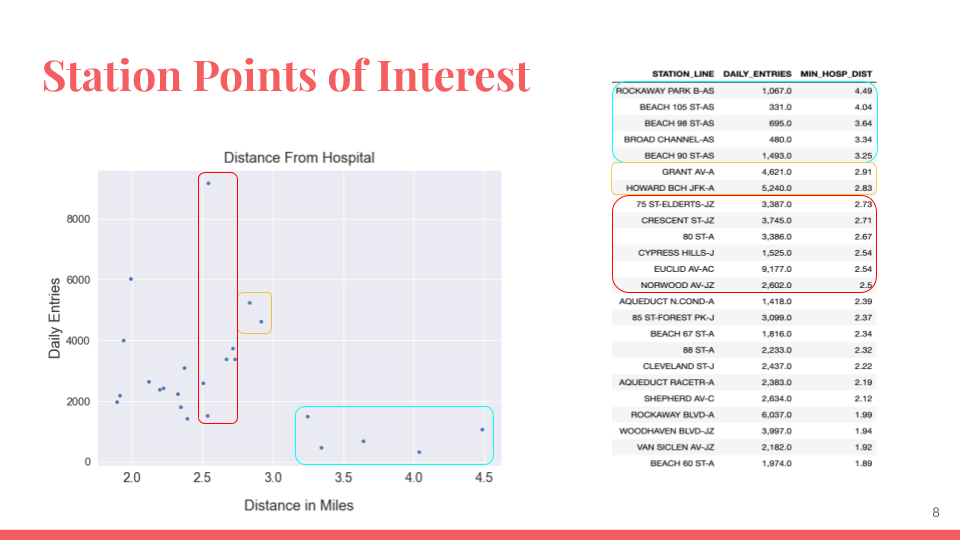

This is partly a test post, partly a *very* brief reflection on my experience with my first project at [Metis](http://thisismetis.com).

I'll deal out some bio as the weeks go on, but suffice it to say that I was THAT kid who always loved math, got a PhD in mineralogy, but for a lot of reasons need a hard career reboot. A friend from grad school suggested materials informatics. The Chief Science Officer of a company in that space suggested data science bootcamps. As I worked LinkedIn looking for intel on those, a couple of people suggested Metis. It seemed like the right place on the scale for me, with all the math background one could ask for but very little coding experience.

So, this first week. Part of why I need this hard reboot is that I have spent a lot of my life hanging back and not asking questions or making suggestions when I could. I've spent a lot of time getting better at this, but this first week of the bootcamp was so intense and disorienting (oh, I suppose this coronavirus business is part of that too) that I reverted somewhat to old ways.

Everyone on my team made contributions--Nicole dug up the hospital location data, Raj and Erik ferreted out station aliases and other problems in the New York MTA data that form the foundation of the project, and Natalie was the one who suggested the scatter plot of ridership vs. distance from the station to the nearest hospital--but I could tell at certain points that the others were slipping away from that key figure and source of insight, starting to put together the presentation without having looked at any of those actual results, and I made two mistakes:

* I didn't say anything or, better, probe gently but insistently for what their actual plan was and whether they were on track. I taught several years of university classes, I have some skill at that.
* I didn't ask for help, because I ddn't take the prerequisite step of looking at our workload and realizing I had allowed myself to absorb too much of it. Some of that was me being greedy, in a sense. I really enjoyed working out the problems of parsing the hospital and station location data and left the ridership data to the others to some extent because I knew I'd be looking at that during our challenge exercise. However, that location data needed to get linked up with the ridership data as quickly as possible so we would have some idea what we were even talking about, and I needed help. I needed to be willing to risk sounding pushy (and oh, my rural Midwestern upbringing is death on people being pushy) and take a slice of informal leadership of the situation.

Our presentation got critiqued pretty heavily by the instructors for being too rambling, spending time on hashing out data about the top ten most used stations, when our really interesting point was to find out that the top twenty or so stations furthest from a hospital were all in southeast Brooklyn (or Rockaway, technically in Queens if memory serves, but adjacent to far southeast Brooklyn). Why so focused there? I thought some would be in the Bronx, some in Queens, but no, all Brooklyn, and specifically on the A, J, C lines near JFK Airport.

I'm done for the night. Catch you later.

--PAG

Blogging platform assembled by Jekyll, Poole, and Zach Miller of Metis.
