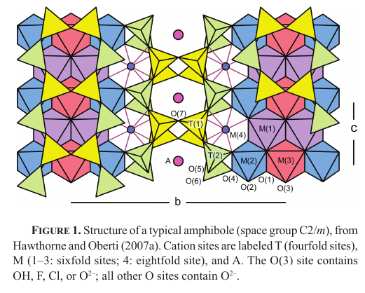
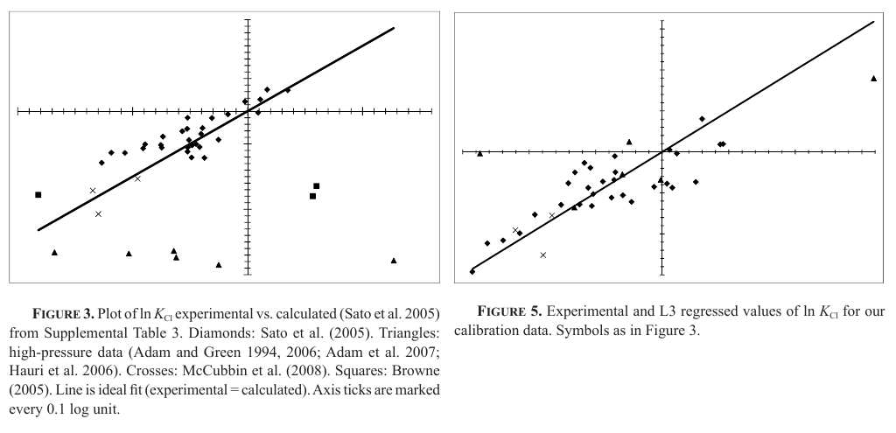
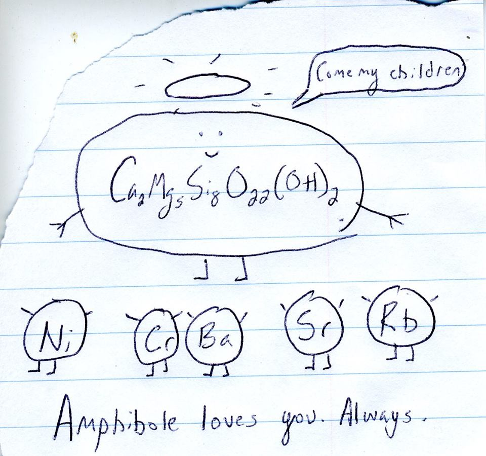

Today I'm going to take a little time to discuss my main "prehistoric" data science project, a research problem I tackled back in 2012-2013 when I was working for Justin Filiberto during his time at Southern Illinois University. My PhD dissertation included something you could definitely call a data science element, but this was definitely data science, however elementary and self-taught the modeling was. You can find the paper at <a href="https://pubs.geoscienceworld.org/msa/ammin/article-abstract/99/4/852/46166/Quantitative-models-linking-igneous-amphibole">GeoScienceWorld</a> and if you are interested in reading it, but don't have a subscription, I can supply you with a copy via <a href="https://www.researchgate.net/publication/279015043_MELT-FLUID_INCLUSIONS_AND_VOLCANIC_PROCESSES_Quantitative_models_linking_igneous_amphibole_composition_with_magma_Cl_and_OH_content">ResearchGate</a>.

### The Big Picture

The goal of my postdoc was to examine the halogen (fluorine and chlorine) chemistry of Martian meteorites. Justin had some analyses done on a slice of a meteorite called NWA 2737. Meteorites are named for the locality where they are found... with luck, they place where they were observed to fall, although the vast majority are "finds" rather than "falls". So, for example, Nakhla was observed to fall and picked up near an Egyptian village of that name in the early 20th century. Lafayette was found in a drawer at Purdue University in the same time period (true story!). Sometimes you can't get very specific. There are over 10,000 "NWA" meteorites, which means they were found somewhere in North West Africa, and brought in for some excited white person to buy. It's apparently a business model.

NWA 2737 is a chassignite, which just means it's a lot like Chassigny. They are both masses of mostly olivine crystals. Rocks like them on Earth are called "cumulates" since the olivine is thought to have crystallized out of a magma and accumulated within a magma chamber. Occasionally within the olivine crystals one encounters little melt inclusions, where drops of magma got trapped and crystallized out. The melt inclusions tell us about the chemistry of the magma at the time they were trapped, while materials in the interstitial space between the crystals tell us about the chemistry of the magma at later points; as petrologists, we're curious about all of it.

Justin's research program includes studying the question of what volatiles were present in Martian magmas, and in what proportion. It's pretty clear by now that the relative abundances of water, carbon dioxide, fluorine, and chlorine were different in Mars' interior as compared to Earth's. Mars had (has) more halogens. That's fascinating, because fluorine and chlorine can start monkeying with the rest of the chemistry of the melt and the minerals crystallizing out of it, but that takes us rather far afield.

### Problem Selection and Data

If you want to study halogens in melt, usually you study a mineral called apatite, Ca5(PO4)3(OH,F,Cl). That had been done before. Justin and I decided I would focus on amphibole, a large mineral *family* whose formula is the far more forbidding AM(4)2M5T8O22(OH,F,Cl,O)2, where (usually!) A = Na, K, or nothing (a vacancy); M(4) = Na, Ca; M = Mg, Fe, Mn, Al, Ti, or bales of other things; T = Al, Si.  Amphibole is tricky. There is a lively and controversial literature about how to calculate its formula. The possible vacancy is a mess; the fact that iron can be 2+ or 3+ is a mess... there's no easy way to distinguish the two, although there are hard ones; the fact that hydrogen is involved is a mess, because it's a royal pain to analyze for hydrogen. No one had really gotten very far in trying to use amphibole to model melt chemistry, for all of these reasons, although there was one courageous Japanese group that did a good study on the rocks from a single volcano. However, they ducked a lot of these problems in constructing their model.

I wanted to construct a model that was applicable to a wide enough variety of amphiboles that my Martian ones might conceivably be covered by them. To do that, I set sail in my pirate ship, with my cutlass between my teeth, and ruthlessly stripped the literature of data. The pickings were slim. In fact, there were only 39 usable analyses in the whole literature, but they were enough to get somewhere.

### Preprocessing

Then I tackled all of the chemical issues head on; for every single one of the problems I mentioned in the paragraph about amphibole chemistry, I found a way of modeling / estimating the quantities in question rather than assuming they were zero, or all ferrous iron, or etc. This is not really the place to go into all of the geochemical literature I ransacked and rebuilt just to get to the point where I could *start* model construction. The paper and the voluminous spreadsheets I put in Supporting Materials do that. It did go on for quite a while, through realms of hydrogen / iron mutual redox and the jungle of ways to calculate the solubility or activity of water in a melt, filling several dozen columns of a spreadsheet, because of course this is a story about data science prehistory, and I was using that delightfully prehistoric tool called Microsoft Excel.

### Regression Modeling

At this point I had to hit my old stats textbook and dig out chapters we'd never covered on Multiple Linear Regression. I constructed no less than 19 features, as I would now call them, using the chemical formula of the amphibole, ratios between different elements, and the pressure and temperature of the experimental runs. I distinctly remember that MS Excel could not handle more than 16 features, so I had to split them up and do some preliminary regularization, as I would now call it, based on the statsmodels-like output from Excel.

Duly warned that the problem was indeterminate, I spent a *long* time trying different sequences of feature elimination. A *long* time, and not enough notes taken on what I had and had not tried, but that's a lesson learned. In the end, I reduced the number to eight, and then finally to three, which seemed a more legitimate number of coefficients for a linear equation regressed over 39 observations (as I would call them now...).

I think it turned out, though. I think the Sato group did yeoman work; I also think my model distinctly outperformed it:

### The Consequences

Once I had the model, I then turned around and illustrated how someone could use it and amphibole chlorine chemistry to infer a lot of the messy missing details from many amphibole analyses and interesting consequences for the chemistry of the surrounding melt to boot. Sadly, this hasn't gotten cited (or, I assume, used) very much. I didn't stay in the field to promote it, and I think the twelfth degree polynomial involved doesn't help most geochemists warm up to the method. *I* certainly used it, though; I forged ahead and learned a lot more messy stuff about hydrogen isotopes and wrote <a href="https://onlinelibrary.wiley.com/doi/full/10.1111/maps.12430">the paper I was hired to write</a> about the hard life NWA 2737 has led.

### Something to Keep in Mind

Especially in tough times like these. (Courtesy one of my Illinois State mineralogy students.)

--PAG

Blogging platform assembled by Jekyll, Poole, and Zach Miller of Metis.
