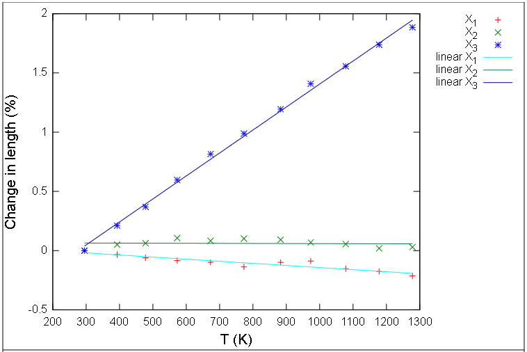
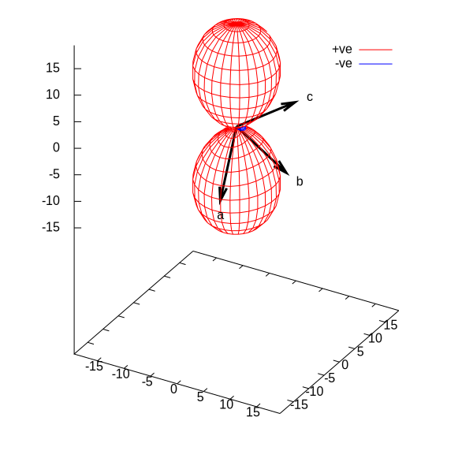

Since I finished at <a href="https://thisismetis.com">Metis</a>, life has been a little less hectic but a lot more uncertain. I'm working on the job search and straining to keep myself focused on my top priorities instead of scattering my networking and job application efforts in every direction based on random input from my environment.

In the meantime, I am working on a project to use my new skills to put something out into the world. Last August I visited my old advisor, Anne Hofmeister at Washington University in St. Louis, to see and try out her dilatometer. It's an apparatus for measuring the thermal expansion of a material. I measured a few feldspar samples (feldspar being the most common mineral in the Earth's crust) and she kept adding to her existing pile. Now I've gotten hold of it and am processing it.

### A Nickel's Worth of Theory

Materials usually expand when they are heated. Highly symmetric materials, like rock salt, pure iron, or most glasses, expand evenly in all directions. Most minerals are asymmetric (feldspar is particularly so) and therefore they expand differently in different directions as the crystal structure accommodates the increasing thermal motion of the atoms.

### The State of the Art

At this point, the most recent papers on the thermal expansion of feldspar are by Guy Hovis at Lafayette and his colleagues. His work is X-ray diffraction work, where a crystalline powder is heated to a set temperature, then a diffraction experiment is conducted to calculate the dimensions and angles of the fundamental building block of the crystal, which are called the lattice parameters. This is great information, but it's rather time consuming and the data are only collected at a handful of temperatures.

The Hovis papers focus on the volume expansion of the feldspar, but you can use that data to calculate it linear expansion in different directions, for example with the <a href="https://pascal.chem.ox.ac.uk/">PASCal routine</a>:

 
 
This feldspar (a potassium feldspar called microcline) actually contracts a little in one direction as it's heated, although overall, the crystal expands in volume. An intriguing alternate way to visualize it is as a surface called a representation quadric (Siegried Haussuhl, __Physical Properties of Crystals__, p. 94), where the magnitude of the thermal expansion in any direction scales the distance of the surface from the origin. In this case negative lobes are depicted in blue.

A geologist has a shot at recognizing this as similar to the figure called an optic indicatrix, which does the same thing for the speed of light in a crystal in different directions. (No negative lobes to worry about there.)

More next time.

--PAG

Blogging platform assembled by Jekyll, Poole, and Zach Miller of Metis.
