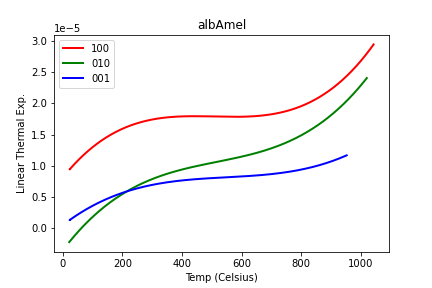

Following on from last week's post, a brief update.

### A Dilatometer? That Sounds...

No, no, don't go there. It's a very family-friendly instrument. Ok, so maybe you shouldn't let your toddler open it while the heater is at 800 C. A pushrod dilatometer is the simplest conceivable thing you could use to measure something's thermal expansion. It has a little cradle to hold a sample, a furnace, a thermocouple to measure the temperature, and a rod held right against the end of the sample to measure how much it expands when heated. (If your sample doesn't like being hot and oxygenated, you can put in under vacuum or a neutral gas.) Anne's instrument is from <a href="https://www.netzsch-thermal-analysis.com/en/products-solutions/dilatometer/dil-402-expedis-select-supreme/">Netzsch</a>.

### Let's Get Some Python Up In Here

You can check the repo out at <https://github.com/PAGiesting/thermal-expansion> to get the latest versions of the scripts. From a software perspective, I'm exercising a lot of muscles related to file manipulation. Correcting the data and fitting it with polynomials is fairly easy. Here's a plot of the data for one of our samples, an albite (a sodium-dominant feldspar): 

 
There are no discrete data points this time because the data is plotted every 0.5 degree. That's the advantage of the dilatometer over the X-ray diffraction approach: very fine temperature control.

The disadvantage is having to cut samples in a specific direction. That is NOT easy, and we may be off by quite a few degrees from the directions I've specified in the plot (via <a href="https://www.tulane.edu/~sanelson/eens211/axial_ratios_paramaters_miller_indices.htm">Miller indices</a>). There is no free lunch.

More next time.

--PAG

Blogging platform assembled by Jekyll, Poole, and Zach Miller of Metis.
