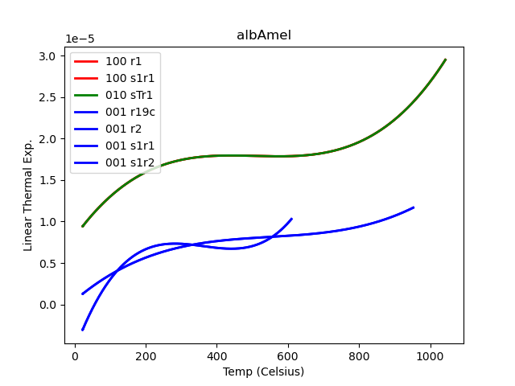
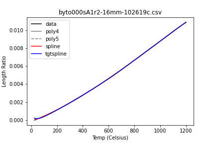
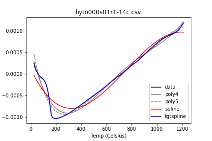
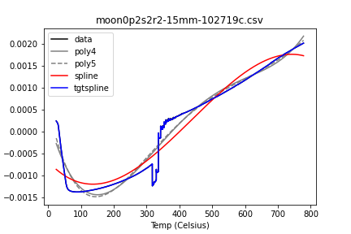

Following on from last week's post, a brief update.

### One of Those Weeks

Last week I showed you a very tidy little picture of three different linear expansion plots for different directions in feldspar:

  

It's amazing what you can talk yourself into being true when it looks neat and tidy. Fortunately my pessimistic instincts (everything is handy for something, sometime) told me to plot ALL the data and see whether I thought I had the best files chosen, and I wound up with this instead:

Although one can be TOO pessimistic. I've apparently lost a file somewhere, because none of the plots in this second figure matches the green trace in the first! But in any case, obviously there are issues here. You can check the <a href="https://github.com/PAGiesting/thermal-expansion/blob/master/plot_scratch.ipynb">workbook</a> where I made the first plot and see how I relentlessly forced data files into the slots 100, 010, and 001 if they weren't filled up by appropriately labeled files. I happened to get good-*looking* results and was willing to run with them for a day or two.

You'll note, as I did, that the second figure's plots, made by my <a href="https://github.com/PAGiesting/thermal-expansion/blob/master/plot_all.py"> new script</a>, which plots everything and color codes it by (claimed!) orientation, has a lot more entries in the legend than visible traces on the plot. Turns out matplotlib is not screwing up... many of the traces are actually identical files right on top of each other. Including traces of different colors, which means that there have been files duplicated and labeled with different orientations.

### So We Messed Up

It's quietly legendary in science how hard it is to keep consistent records via lab notebooks or, in this case, entering the right metadata into the instrument software prior to data acquisition. A big part of the problem is that it's not "entering" so much as "updating" and as is often the case, for this particular application one might only need to change the filename and the description line out of about 20 blanks in the window. Next time it might be 5, though, and next week it might be 10, and it's easy to forget.

It's the same problem anyone encounters when they try to enforce data collection. People just don't fill out the form correctly... even when they created the form.

### And Research Is Difficult

Then there's the fact that prepping and heating geological materials is difficult and has unexpected consequences. Here I was testing different fits to the raw data and, at the same time, looking at the raw data itself.

What's being plotted here is fractional increase in length with temperature. These curves need to be differentiated to get the alphas I plotted above.

You kind of want them to look like this (although that droop at the beginning is likely the sample / apparatus settling, not real and not desirable):

I don't so much trust them when they look like this:

And I'm not a fan of this:

More next time. I'm taking a week off and moving in a different direction going forward... probably a while before another thermal expansion post.

--PAG

Blogging platform assembled by Jekyll, Poole, and Zach Miller of Metis.
