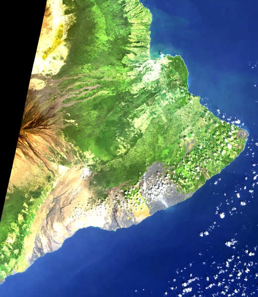
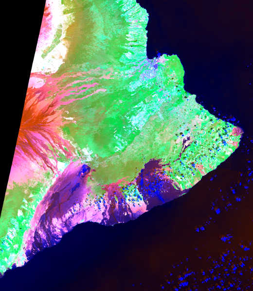
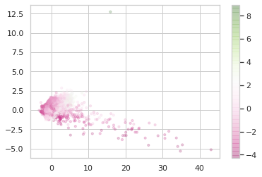
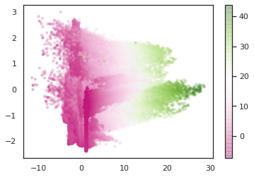
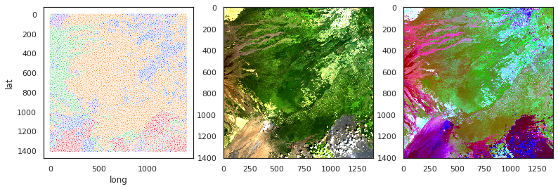
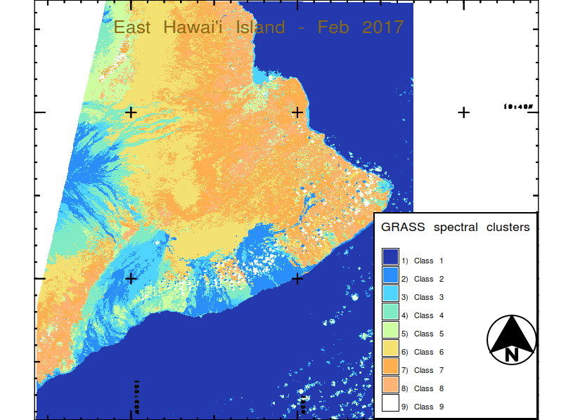
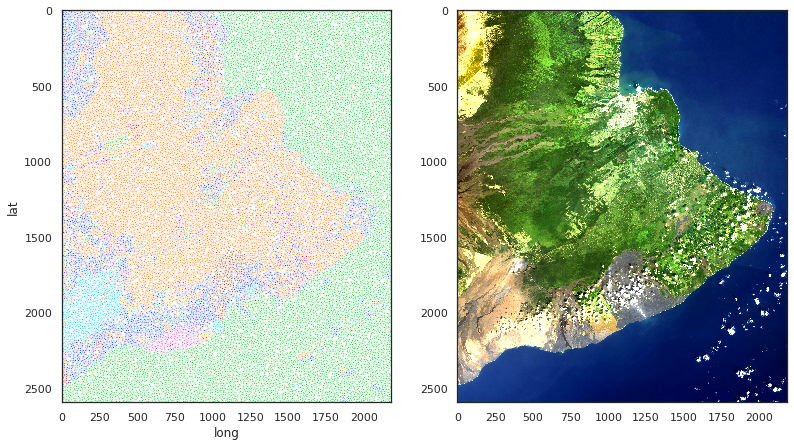
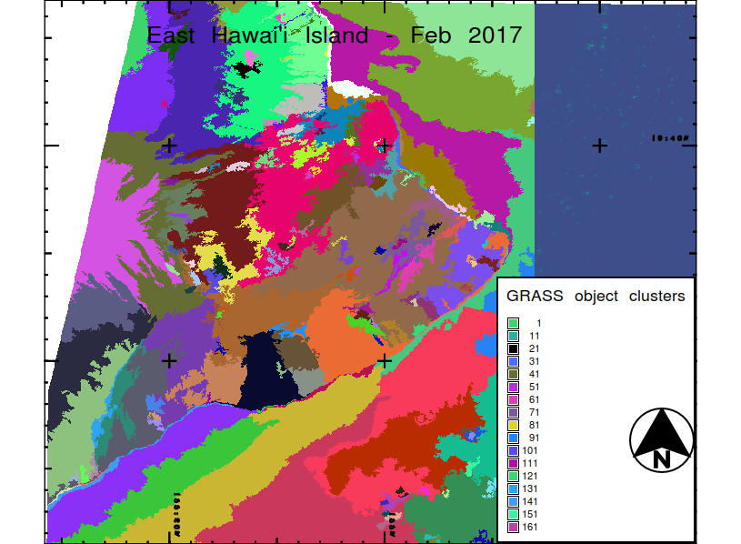
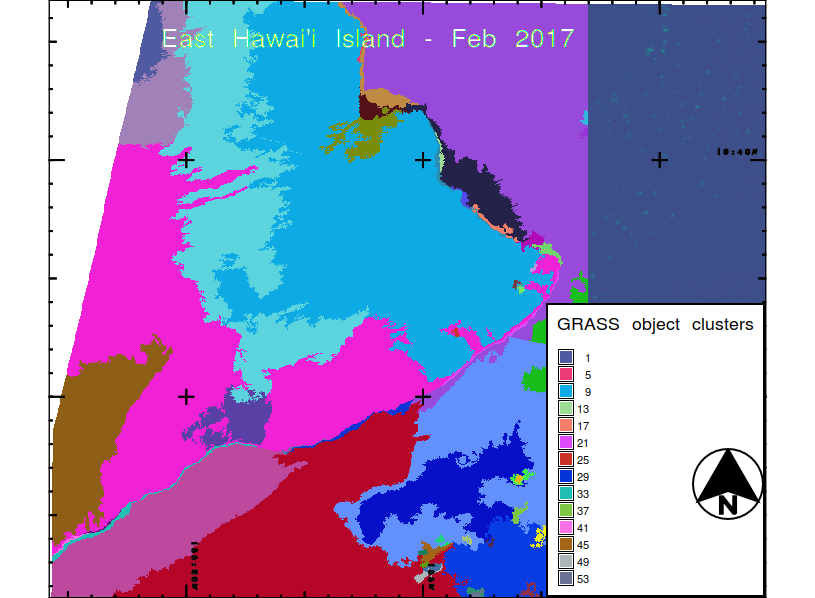

Today I'm going to give a brief overview of my capstone project at <a href="https://thisismetis.com">Metis</a>. I've placed core code on Github <a href="https://github.com/PAGiesting/Landsat8Landscaping">here</a>, you can see my presentation deck <a href="https://docs.google.com/presentation/d/1JPWXbmUdk4oJHFBNbvCLJ0ejnRdVXsF6ncN3VY5mios/edit?usp=sharing">here</a>, and watch me deliver it <a href="https://youtu.be/AVs90gWAPGw">here</a>.

### Ruthless Exploitation

I thrashed around an enormous amount trying to come up with a topic in materials science, but the data is Just. Not. There. Yet. It's all balkanized into tiny little datasets with the exception of a few databases created by running automated sequences of chemical calculations. There are people laboring mightily at projects like <a href="https://mdf-forge.readthedocs.io/en/master/">Forge</a> and at companies like <a href="https://citrine.io/">Citrine</a>, but there is so much work to do, and a bootcamp is not the place to do it; a bootcamp is about learning tools, and while that includes tools to deal with messy data, it doesn't involve working miracles with impossible data.

Therefore, one last time, I decided to exploit my background in geoscience and look at multispectral remote sensing data. I was an infrared spectroscopist for a while in grad school and I have a love affair with Hawai'i, so it was an obvious connection.

### Problem Selection and Data

My initial idea was ambitious: try to calibrate a model to estimate the age of lava flows in Hawai'i from satellite multispectral remote sensing data. As a Minimum Viable Project, I wanted to get to the point of performing a clustering analysis on some moderate amount of data.

  

So the above is a true-color image of the eastern Big Island of Hawai'i processed in Python by yours truly from a Landsat 8 tile collected in 2017. This is about as few clouds as you ever get on the east side of a Hawai'ian island; that's why I had to go back a few years.

The brown lava flows are directed away from the summit of Mauna Loa, which is probably outside the tile, although it might be in that damnable "no data" triangle in black at the upper left. North of Mauna Loa is Mauna Kea, which is just a bit taller. Kilauea is built on the flank of Mauna Loa. Kilauea lava covers the area from the southwesternmost gray patch along the coastline out to the eastern tip of the island. The town of Hilo is the bright patch on the indentation (Hilo Bay) in the coastline in the north central part of the image.

Landsat 8 collects data in 11 bands, four visible (a fringe violet band to complement the ordinary blue, green, and red), five in the infrared, and a few special bands like the panchromatic band. I picked out the visible bands 1-4 and near to mid infrared bands 5-7 to work with.

### Preprocessing

\<insert long story about wrestling with geospatial data formatting here\>

I spent a week on this phase, leaving a week for everything after, pretty much. Man, did I learn a lot. And as forbidding as the GRASS GIS software package is, it can do some really amazing things like take topographic data and calculate where watersheds would be based on slope geometry. It has its own routines for doing spectral clustering / classification and segmentation, but I was far into doing things my own way with Python tools by the time I thought to look for *that*, so I stuck with doing the clustering in "raw" scikit-learn as my project.

### Principal Component Analysis

You're all aware that for clarity, I'm presenting this in a clean and pretty sequence that has little to do with the chaotic and wandering order in which it got done, right? Good.

As it turns out, a great thing to do with seven channels of spectral data is to use PCA to reduce its dimensionality. Three components sponged up over 95% of the variance in the data. Interestingly, the three components turned out to be, basically, "brightness" (~70%), "vegetation" (~20%) focused on near-IR band 5, and "rockness" (or heat, ~5%) focused on mid-IR bands 6 and 7.

And once you've got three components, you might as well visualize them in a false color map. Mapping "brightness" to blue, "vegetation" to green, and "rockness / heat" to red, you get the following charming piece of pop art:

Comparing this image to my (admittedly, questionably balanced and contrasted) true color image above, additional detail is evident in several areas: the glow of the active lava lakes in Halema'uma'u and Pu'u O'o that day in 2017, structure in the Kilauea lava flows extending down to the coast, teal to green to brown coloration of vegetation (would like to go back and figure out which color means macadamia nut grove), and every last urban detail of Hilo. To be fair, the flows extending off Mauna Loa look just as nuanced in true color, maybe more. Still, as an amateur volcanologist I find this image fascinating.

### It's a Cluster

(I can't imagine how often this joke must have already been used in data science circles.)

So the PCA analysis can already give us pretty pictures; it's also quite helpful as prep work for doing clustering analysis, because the Curse of Dimensionality is a real thing. (I believe there was some Dimensional Lich or something involved, but maybe I've just played Phantasy Star IV way too many times.)

There are two things to try here as I've already alluded:

* Classification. The goal here is to create clusters from the pure spectral data. A pixel in a given cluster presumably represents a given type of landscape anywhere across the map. The clusters might wind up meriting names like "ocean," "barren lava," or "forest" at a low level of splitting, or "less than a decade old lava," "native vegetation type 1," "agricultural land type 2," or something like that at a high level of splitting = large number of clusters.
* Segmentation. Here clustering is done on spatial and spectral data together... or at least, that was my approach. In addition to spectral channels, latitude, longitude, and potentially elevation would be thrown in as features. Now a pixel in a given cluster represents a particular spatially associated landform and you might give the clusters names like "the Mauna Ulu lava flow field" or "Sherwood Forest" (not to be found on this map, but you know).

Were one to tackle this without dimensionality reduction, it would mean clustering in 7 dimensional space (for classification) or 10 dimensional space (for segmentation). I tried this. Didn't get very far. So having already done PCA, I stuck with 3 components for classification (the same 3 components I already had for imaging) and also reduced to 3 components for segmentation. Number of reduced dimensions is effectively another hyperparameter that could be tuned for clustering, but I didn't get that far.

I picked out the DBSCAN and Mean Shift algorithms for clustering for a few reasons: First, I didn't want to get into the business of picking *k* (number of clusters) for *k*-means, although that was kind of a silly reason since I was going to gridsearch over hyperparameters anyway. I might as well go back and try gridsearching over *k* from, say, 5 to 20 if I go back and revisit this little project. Second, I wanted points to be able to wind up in noise, since my hunch was that there would be mixed and otherwise weird pixels that I didn't need or want to shove into a cluster. (Technically I wanted to *cluster* rather than *partition* the pixels.) That's actually a much better reason to pass on *k*-means.

DBSCAN and Mean Shift also have specific advantages that may have turned out to be helpful here. Mean Shift can pick out clusters of varying density better than other algorithms. If you feast your eyes on this questionable Seaborn visualization of the spectral data in PCA space, you might convince yourself that might be an advantage here:

DBSCAN prides itself on picking out strangely-shaped clusters, following elongated clusters through space rather than "expecting" to find roughly equant clusters (if you don't like "equant," how about "low aspect ratio," or could I interest you in "roughly spherical" perhaps). Maybe that would be useful for the reduced spatial + spectral data:

In any case, it's still a tricky problem. A lot of hyperparameter choices lead to uninteresting results. Here are a couple of the best-looking results. For classification, here's a good Mean Shift take on the scene clipped to just focus on land:

Viewer beware: there are 118 clusters total, although most of the clusters have only a few pixels in them. Beware of Seaborn cycling through its color palette that many times. That's not great. Dark blue is (mostly) noise points. Still, there's a lot of good stuff in here. Fresh Kilauea lava is obviously red, and green is mostly Mauna Loa lava... probably spectrally different due to weathering at higher elevation. Vegetation is in that big orange cluster. This is rough, but I'll take it for a project that demanded this much preprocessing and under these constraints. You can compare it to professional grade work from GRASS GIS:

I refuse to feel shame for being outdone by a project with as many person-hours behind it as GRASS! Obviously those people know their stuff. Here Class 1 is obviously ocean, Classes 2, 3, 4 are fresh to weathered lava flows (or sediment in Hilo Bay!), Class 5 is a grab bag of urban, upland Mauna Kea pastureland, and landslide scarps on the flank of Kilauea, Classes 6, 7, and 8 are grades of vegetation, and Class 9 is pretty much clouds. GRASS picked these out, starting with the seven raw LANDSAT 8 channels, with no training; I'm interpreting them after the fact. I did have to feed it a *k*, but I fed it 10 and it kicked one out in some poorly documented fashion, so its secret sauce algorithm can perform some form of regularization.

Here's a segmentation take from DBSCAN:

This has 332 clusters, and is actually the result for the smallest numbers I chose for both core distance parameter and core number. Noise is once again in dark blue, although so are a lot of other clusters. Seaborn color cycling is once again an issue; I suspect that's why the ocean seems to have invaded the lower slopes of Pu'u O'o (south central) in this image: both clusters just happen to be coded green. (I wrote an example routine to recolor clusters according to the PCA projection of the cluster centroid in spectral space, but 1) didn't get it implemented for my production figures in time, 2) it would be difficult for weird-shaped clusters picked out by DBSCAN in the segmentation data space to define a sensible spectral-only centroid... and the centroid might be outside the cluster! and 3) lack of contrast might be a problem.)

I was intrigued to see that even this finely divided segmentation result picked out nearly the whole vegetated region as a single cluster. The summit area of Kilauea and its flank vents Mauna Ulu and Pu'u O'o are picked out as different segments or groups of segments from their seaward lava flow fields (you can see these in teal, magenta, and green respectively, if you look back at the true color image for guidance on Pu'u O'o). I was disappointed that several of the Mauna Loa flows got lost (unless they're in orange!).

There is a ton more one could do to adjust these results. For example, one thing I played with was placing spatial and spectral data on different scales. The results I showed were from PCA and clustering on data where all the spatial and spectral dimensions were put through a StandardScaler. I also tried clustering in the full dimensional space with the spatial or spectral dimensions shrunk by a factor of 10 (too much, likely) after standard scaling, but not after PCA.

To wrap up, here are two different GRASS takes on the segmentation problem:

The segmentation routine in GRASS is far too complex to describe in this already huge blog post, but it's intriguing in its own right (I believe `i.segment` is the routine's name if you are curious). One thing I can say for my little effort here, though: I can put the ocean in one segment, which seems to be hard for the GRASS algorithm. In the lower figure, the land segments have already blurred out and lots of good distinctions have been lost, while the ocean is still kind of inexplicably segmented.

Maybe I'll try contributing some code someday...

--PAG

Blogging platform assembled by Jekyll, Poole, and Zach Miller of Metis.
